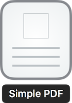
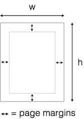

<p align="center">
    
</p>

<p align="center">
   
    <a href="https://developer.apple.com/swift">
        
    </a>
    
</p>


SimplePDF is a wrapper of UIGraphics PDF context written in Swift.

You can:
- [x] add texts, images, spaces and lines, table
- [x] set up page layout, adjust content alignment
- [x] generate PDF data/file.

In summary, you can create a simple PDF effortlessly. :smile:

## Example

```swift
let A4paperSize = CGSize(width: 595, height: 842)
let pdf = SimplePDF(pageSize: A4paperSize)

pdf.addText("Hello World!")
// or
// pdf.addText("Hello World!", font: myFont, textColor: myTextColor)

pdf.addImage( anImage )

let dataArray = [["Test1", "Test2"],["Test3", "Test4"]]
pdf.addTable(rowCount: 2, columnCount: 2, rowHeight: 20.0, columnWidth: 30.0, tableLineWidth: 1.0, font: UIFont.systemFontOfSize(5.0), dataArray: dataArray)

let pdfData = pdf.generatePDFdata()

// save as a local file
try? pdfData.writeToFile(path, options: .DataWritingAtomic)
```

See the result [example.pdf](Assets/example.pdf), which is generated from [ExampleCode.swift](ExampleCode.swift).

## Installation

via [Cocoapods](https://cocoapods.org)

```ruby
use_frameworks!
pod 'SimplePDF'
```

## Usage

```swift
import SimplePDF
```

### Page Setup



```swift
let A4paperSize = CGSize(width: 595, height: 842)
let pdf = SimplePDF(pageSize: A4paperSize, pageMargin: 20.0)
// or define all margins extra
let pdf = SimplePDF(pageSize: A4paperSize, pageMarginLeft: 35, pageMarginTop: 50, pageMarginBottom: 40, pageMarginRight: 35)
```

### Write Something

```swift
pdf.addText( "some text" )
pdf.addImage( UIImage )
pdf.addAttributedText( NSAttributedString )
pdf.addLineSeparator(height: 30) // or pdf.addLineSeparator() default height is 1.0
pdf.addLineSpace(20)
```

### Layout
You can layout horizontally and vertically
```swift
// Start a horizonal arrangement
pdf.beginHorizontalArrangement()
// Add space from the left
pdf.addHorizontalSpace(60)            

// now add your text, table, image, ...

// finishe the horizontal arrangement so you can continue vertically
pdf.endHorizontalArrangement()

// adds a vertical space
pdf.addVerticalSpace(70)
```

### Table Definitions
Define the layout of tables with definitions
```swift
let tableDef = TableDefinition(alignments: [.left, .left],
                               columnWidths: [100, 300],
                               fonts: [UIFont.systemFont(ofSize: 20),
                                       UIFont.systemFont(ofSize: 16)],
                               textColors: [UIColor.black,
                                            UIColor.blue])
         
let data = [] // my data
         
pdf.addTable(data.count, 
             columnCount: 2, 
             rowHeight: 25, 
             tableLineWidth: 0, // this is taken from the definition
             tableDefinition: tableDef, 
             dataArray: data)
```

### Utilities

```swift
pdf.beginNewPage() // Begin a new page
```

These following commands will affect everything you write after you call.

```swift
pdf.setContentAlignment(.Center) // .Left, .Center, .Right
```

### Generate PDF data

```swift
let pdfData = pdf.generatePDFdata()

// write to file
try? pdfData.writeToFile(path, options: .DataWritingAtomic)

// or upload to Internet
// For example, Alamofire.upload(...)
```

## License
SimplePDF is available under the [MIT License](LICENSE).

## Authors
Nutchaphon Rewik

[![my twitter][1.1]][1]

[1.1]: https://img.shields.io/badge/Twitter-@nRewik-blue.svg?style=flat-square
[1]: https://www.twitter.com/nRewik
